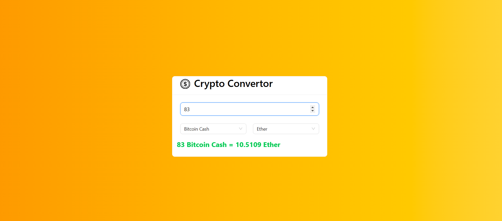

# Crypto Convertor

# It is built based on React, JavaScript and Tailwind Css

## Steps
- First enter the number
- select first currancy
- select second currency

# Api Calls
- API data will be stored in array of objects and data will be presented on components as per requirement

  

